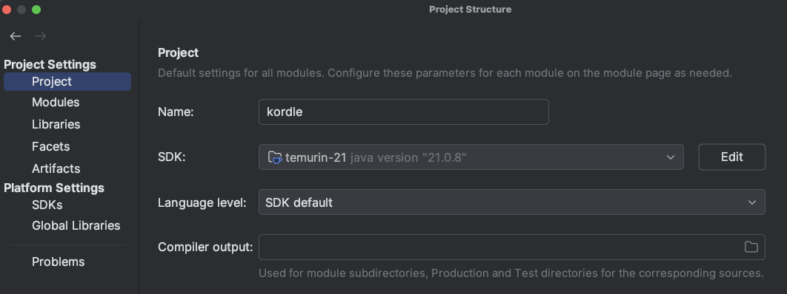
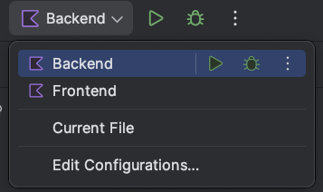

# Kordle

Hei og velkommen til Kordle!
Kordle er et spill inspirert [wordle](https://www.nytimes.com/games/wordle/index.html), hvor en gjetter på et tilfeldig
valgt ord.

## Spillregler

1. Du har 6 forsøk på å gjette et ord.
2. Hvert ord er mellom 4 og 6 bokstaver langt.
3. Hver gang du gjetter et ord, vil du få tilbakemelding på hvilke bokstaver som er riktige og hvor de er plassert.
   Dette indikeres ved
    - Grønn: Bokstaven er riktig og på riktig plass.
    - Gul: Bokstaven er riktig, men er ikke på riktig plass.
    - Sort: Bokstaven er ikke i ordet.
4. Du kan ikke gjette ord som ikke er i ordlisten.
5. Ved duplikate bokstaver i det gjettede ordet, vil du få tilbakemelding lik antall ganger bokstaven er i ordet.
   F.eks: Dersom ordet er "etse" og du gjetter "test", vil du få tilbakemeldingen:
    1. Den første "t" er gul, da den er i ordet men ikke på rett sted.
    2. Den første "e" er gul, da den er i ordet men ikke på rett sted.
    3. Den første "s" er grønn, da den er i ordet og på rett sted.
    4. Den andre "t" er sort, da den er i ordet men en har allerede fått tilbakemelding på "t" i posisjon 1.

## Teknologier

### Intellij

Intellij er en IDE (Integrated Development Environment) som er laget av JetBrains. Den er veldig populær blant
Java-utviklere og har mange funksjoner som gjør det enklere å utvikle kode.

Dere skal allerede ha installert Intellij Community edition men hvis en ikke har det kan
en [laste det ned her](https://www.jetbrains.com/idea/download/).

### Gradle

Gradle er et byggverktøy som brukes til å bygge og kjøre prosjekter.
Det er et alternativ til Maven, som er et annet populært byggverktøy.
Gradle blir installert av Intellij som en del av prosjektet, så det er ikke nødvendig å installere det separat.

### Java 21

Kotlin kjører på JVM (Java Virtual Machine), så vi trenger Java for å kjøre Kotlin-koden vår.

### Spring boot

[Spring Boot](https://spring.io/projects/spring-boot) er en utvidelse av Spring-rammeverket som hovedsakelig brukes for
å lage backend-applikasjoner i Java/Kotlin.
Springboot tilbyr mye funksjonalitet "out of the box", noe som gjør det lettere å kjapt lage en applikasjon som tilbyr
verdi.
Nevneverdig funksjonalitet som tilbys av Spring Boot er:

- Lett opprettelse av REST API-er
- Lett håndtering av sikkerhet på endepunkter
- God støtte for databaseoperasjoner
- Produksjon av metrikker for overvåking av applikasjonens bruk og ytelse
- Automatisk konfigurasjon av applikasjonen basert på miljøet den kjører i
  og mye mer!

### H2

[H2](https://www.h2database.com/html/main.html) er en lettvekts database som er skrevet i Java. Den er enkel å bruke og
kan kjøres i minnet, noe som gjør den perfekt for utvikling og testing.
Databasen kan konfigureres til å kjøre på mange forskjellige måter, men i dette prosjektet lagres databasen som fil(er)
i mappen `/database`. Dette betyr at databasen er persistent på tvers av kjøringer, og at dataene ikke går tapt når
applikasjonen stoppes.

### LWJGL3

[LWJGL3](https://www.lwjgl.org/) (Lightweight Java Game Library) er et sett med Java-biblioteker som brukes til å lage
spill og grafiske applikasjoner.
I vårt prosjekt bruker vi LWJGL3 for å kjøre opp en skrivebordsapplikasjon som viser GUI-en (Graphical User Interface)
for spillet.

## Kom i gang

1. Sett opp prosjektet til å bruke Java 21
    * Gå til `File` -> `Project Structure` -> `Project` -> `SDK` og velg `temurin-21`. Dette er da Java versjon 21.
    * Hvis du ikke har Java 21 installert, kan du laste det ned via Intellij ved å:
        * Gå til `File` -> `Project Structure` -> `Platform settings` -> `SDKs`
        * Klikk på `+`-knappen og velg `Download JDK`
        * På `Version` velger du 21 og på `Vendor` velger du `Eclipse Temurin`
        * Klikk `Download` og vent til det er ferdig.
        * Når det er ferdig, velger du `temurin-21` i `File` -> `Project Structure` -> `Project` -> `SDK`.

Når alt er klart, skal det se slik ut:


2. Øverst til høyre i Intellij, ser en en dropdown-meny som inneholder kjøretidskonfigurasjoner. Inne i denne
   dropdown-menyen har en to konfigurasjoner:
    1. `Frontend` - Dette er for å kjøre skrivebordsapplikasjonen.
    2. `Backend` - Dette er for å kjøre serverapplikasjonen.

Dette skal se slik ut:



3. Kjør opp spring-applikasjonen ved å velge `Backend` i dropdown-menyen og trykke på den grønne play-knappen. Dette vil
   da:
    1. Starte opp en Spring Boot-applikasjon som lytter på port 8080.
    2. Starte opp vår H2-database på port `9090` og laste inn en liste med gyldige ord som kan brukes i spillet.

4. Når serveren er oppe, kan en starte opp skrivebordsapplikasjonen ved å velge `Frontend` i dropdown-menyen og trykke
   på den grønne play-knappen. Dette vil da:
    1. Starte opp en LWJGL3-applikasjon som viser GUI-en for spillet.
    2. Koble til serveren som kjører på port 8080 for å hente ordlisten og sende gjetninger.

5. Kjør kommandoen

```bash
curl -X GET http://localhost:8080/health
```

Hvis du får en respons som sier `Kordle server is running`, så er serveren oppe og kjører som den skal!
Om alt har gått knirkefritt så skal du nå være klar til å ta fatt på oppgavene! 🚀 Hvis ikke så rop ut, så kommer vi og
hjelper! 🏃💨

## Om prosjektet

Prosjektet er delt inn i flere moduler, hver med sitt eget formål:

- `server`: Backend-applikasjonen med spring. <b> Her er det oppgavene skal utføres </b>
- `core`: Hovedmodulen som inneholder spilllogikken og er delt mellom alle
- `lwjgl3`: Hovedmodulen for skrivebordsplattformen, bruker LWJGL3.
- `shared`: En felles modul med [Data Transfer Objects (DTOs)](https://en.wikipedia.org/wiki/Data_transfer_object) som
  deles mellom `core` og `server` plattformene.
- `wordgeneration`: En modul for uthenting av gyldige ord fra en ekstern API, og generering av ordlister for bruk i
  spillet.

A [libGDX](https://libgdx.com/) project generated with [gdx-liftoff](https://github.com/libgdx/gdx-liftoff).

This project was generated with a Kotlin project template that includes Kotlin application launchers
and [KTX](https://libktx.github.io/) utilities.

## Platforms

- `core`: Main module with the application logic shared by all platforms.
- `lwjgl3`: Primary desktop platform using LWJGL3; was called 'desktop' in older docs.
- `server`: A separate application without access to the `core` module.
- `shared`: A common module shared by `core` and `server` platforms.

## Gradle

This project uses [Gradle](https://gradle.org/) to manage dependencies.
The Gradle wrapper was included, so you can run Gradle tasks using `gradlew.bat` or `./gradlew` commands.
Useful Gradle tasks and flags:

- `--continue`: when using this flag, errors will not stop the tasks from running.
- `--daemon`: thanks to this flag, Gradle daemon will be used to run chosen tasks.
- `--offline`: when using this flag, cached dependency archives will be used.
- `--refresh-dependencies`: this flag forces validation of all dependencies. Useful for snapshot versions.
- `build`: builds sources and archives of every project.
- `cleanEclipse`: removes Eclipse project data.
- `cleanIdea`: removes IntelliJ project data.
- `clean`: removes `build` folders, which store compiled classes and built archives.
- `eclipse`: generates Eclipse project data.
- `idea`: generates IntelliJ project data.
- `lwjgl3:jar`: builds application's runnable jar, which can be found at `lwjgl3/build/libs`.
- `lwjgl3:run`: starts the application.
- `server:run`: runs the server application.
- `test`: runs unit tests (if any).

Note that most tasks that are not specific to a single project can be run with `name:` prefix, where the `name` should
be replaced with the ID of a specific project.
For example, `core:clean` removes `build` folder only from the `core` project.
