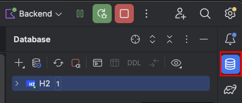
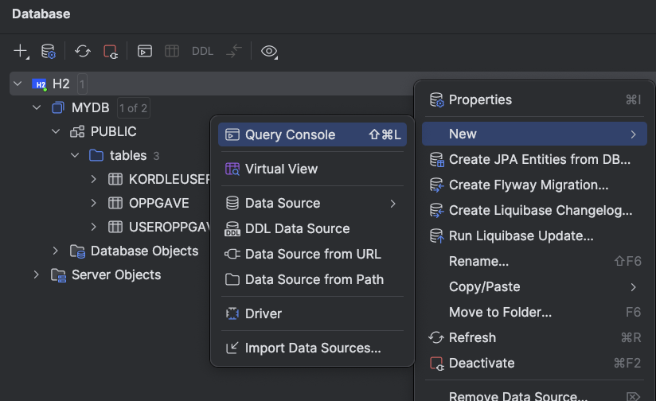
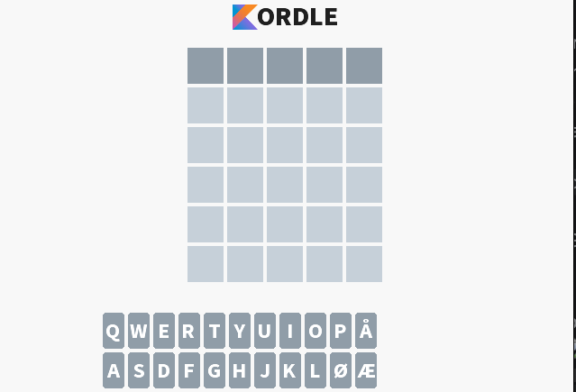

# Hent en tilfeldig oppgave

For at vår appliaksjon skal fungere, må vi kunne hente ut et ord som brukeren kan gjette på.
I denne workshoppen har vi opprettet en database med ord som en kan gjette på i Kordle. Disse ordene er lagret i
databasetabellen `oppgave`.
Disse ordene kan sees ved å

1. Kjøre opp backend-applikasjonen.
2. Trykke på `database`-fanen helt til høyre i Intellij.



3. Trykke på `H2` -> `MYDB` -> `PUBLIC` -> `tables` -> `OPPGAVE`
4. Her vil en se at tabellen består av følgende kolonner:
    - `id` - ID-en til oppgaven
    - `ord` - Ordet som skal gjettes på
    - `lengde` - Lengden på ordet

5. Ved å høyreklikke på `H2` og trykke på `New`-> `Query Console` kan en skrive SQL-spørringer for å hente ut data fra
   databasen.

   

## Oppgave 1.1 Hent ut alle oppgaver fra databasen

I denne oppgaven skal vi hente ut alle oppgavene fra databasen ved hjelp av en SQL-spørring. Les mer om SQL-spørringer
her: https://www.w3schools.com/sql/sql

Oppgaver:

1. Skriv en SQL-spørring som henter ut alle oppgaver fra tabellen `oppgave` i databasen.
   Du kan gjerne teste spørringen i `Query Console` først.
2. Legg inn spørringen i funksjonen `hentAlleOppgaver` i `OppgaveRepository.kt`.

<details>
<summary> Løsningsforslag </summary>

```kotlin
fun hentAlleOppgaver(): List<Oppgave> {
    return jdbcTemplate.query(
        """
        SELECT * FROM OPPGAVE
        """.trimIndent(),
        DataClassRowMapper(Oppgave::class.java),
    )
}
```

</details>

## Oppgave 1.2 Spring-annotasjoner og Forretningslogikk

Spring bruker annotasjoner for å definere hvordan det spring kaller <i>komponenter</i> skal oppføre seg. Slike
komponenter
er vanligvis klasser som er annotert med f.eks. `@Service`, `@Repository` eller `@Controller`.
Et eksempel på dette kan sees i `OppgaveRepository.kt`, hvor vi har annotert klassen med `@Repository` for å fortelle
spring at dette er
en <i>komponent</i> som skal brukes til å hente ut data fra en datakilde, i dette tilfellet en database.

Det kule med dette er at spring automatisk vil opprette en instans av denne klassen og gjøre den tilgjengelig for
andre komponenter som trenger den. Dette kalles <i>Dependency Injection</i> og er en viktig del av hvordan spring
fungerer. I praksis betyr dette at vi kan bruke `OppgaveRepository` i andre komponenter uten å måtte opprette en instans
av den
selv og en kan heller la Spring håndtere dette for oss.

Oppgaver:

1. I `OppgaveService.kt`, dra inn `OppgaveService` som en dependency ved å legge den til som et parameter i klassen
   `OppgaveService`
2. Lag en funksjon i `OppgaveService.kt` som henter ut alle oppgaver ved å bruke `oppgaveRepository.hentAlleOppgaver()`.
   Videre skal en velge en tilfeldig oppgave fra listen med oppgaver og returnere et objekt av typen `Oppgave`
   (Tips: En kan bruke `.random()`-funksjonen på en liste for å hente ut et tilfeldig element fra listen)

<details>
<summary> Løsningsforslag </summary>

Oppgave 1:

Vi kan dra inn `OppgaveRepository` i `OppgaveService` ved å legge den til som et parameter i konstruktøren til
`OppgaveService`. Dette gjør at Spring kan opprette en instans av `OppgaveRepository` og injisere den inn i
`OppgaveService`.

```kotlin
@Service
class OppgaveService(
    val oppgaveRepository: OppgaveRepository
) {
    ...
}
```

Oppgave 2:

```kotlin
fun hentTilfeldigOppgave(): Oppgave {
    val alleOppgaver = oppgaveRepository.hentAlleOppgaver()
    val tilfeldigOppgave = alleOppgaver.random()
    return tilfeldigOppgave
}
```

</details>

## Oppgave 1.3 Api-endepunkt og Data Transfer Objects (DTOer)

For denne oppgaven skal vi lage et GET endepunkt som bruker funksjonaliteten vi har laget i `OppgaveService.kt` for å
hente ut en tilfeldig oppgave.
I Spring bruker vi annotasjonen `@GetMapping` for å lage et GET-endepunkt
Les mer om Requestmapping i
spring [her](https://docs.spring.io/spring-framework/reference/web/webmvc/mvc-controller/ann-requestmapping.html)

Videre skal vi bruke et Data Transfer Object (DTO) for å sende data mellom serveren og klienten. DTO-er er enkle
klasser som kun inneholder data og ingen forretningslogikk. DTOer eksisterer ofte som et mellomledd for å skille mellom
intern
foretningslogikk og data som skal sendes over nettverket. I dette tilfellet vil vi f.eks. ikke sende over objektet
`Oppgave`,
da det objektet inneholder "sensitiv" informasjon, e.g. inneholder ordet brukeren skal gjette på. Dermed har vi laget et
DTO-objekt `OppgaveResponse`,
som ikke inneholder denne dataen.

1. Lag en ny funksjon i `OppgaveController.kt` som henter ut en tilfeldig oppgave og returnerer en `OppgaveResponse`.
2. Omgjør denne funksjonen til et GET-endepunkt ved å bruke annotasjonen `@GetMapping`. Endepunktet skal ha URLen
   `/hentTilfeldigOppgave`"

<details>
<summary> Løsningsforslag </summary>

Oppgave 1:

```kotlin
fun hentTilfeldigOppgave(): OppgaveResponse {
    return oppgaveService.hentTilfeldigOppgave().tilOppgaveResponse()
}
```

Oppgave 2:

```kotlin
@GetMapping("/hentTilfeldigOppgave")
fun hentTilfeldigOppgave(): OppgaveResponse {
    return oppgaveService.hentTilfeldigOppgave().tilOppgaveResponse()
}
```

</details>


🧪 Når du er ferdig, kan du kjøre opp frontend-applikasjonen og teste om endepunktet fungerer ved å åpne opp
applikasjonen. Hvis det ser slik ut:



er alt tipp topp! 🎉
